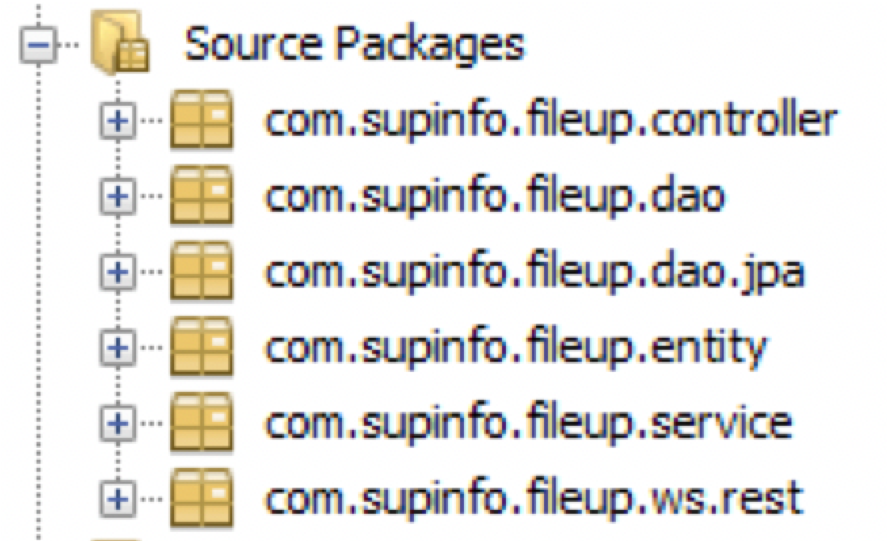
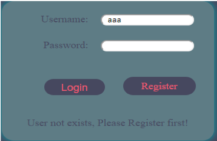
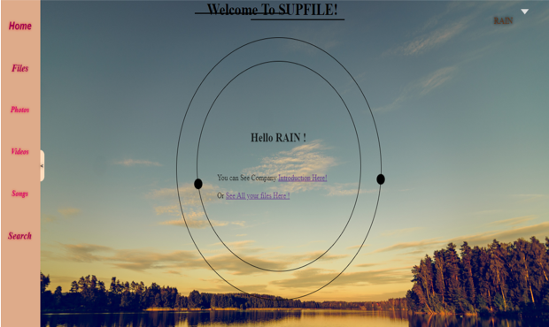

https://siqi-du.github.io/Cloud-Drive/

# Cloud Drive

This website includes 3 main systems:  Storage system, User Registration, File System and File System. 

The system allocated 30GB of storage to new user on the least used storage server;

Users can login with Google or Facebook accounts; view their profile; 

Basic file operations include upload, download files and folders through drag and drop; copy cut or paste files and folders;delete and rename folders; display videos and pictures online; share files by public links. 

 

Techniques
--------------
Backend: Java Server Faces framework on Glassfish, Frontend: PrimeFaces library, Database: MySql

 
Model: MVC

 

Architecture
------------
High availability for glassfish cluster, web clients and storage servers, iSCSI based storage

 

Web APIS
------------

Front-end and Android application communicate with backend through RESTful APIs.

**User services**
 
<table>
    <tr>
        <th>Function</th>
        <th>HTTP Method</th>
        <th>Endpoint</th>
    </tr>
    <tr>
        <td>Register</td>
        <td>POST</td>
        <td>/rest/auth/register</td>
    </tr>
    <tr>
        <td>Login</td>
        <td>POST</td>
        <td>/rest/auth/login</td>
    </tr>
    <tr>
        <td>Logout</td>
        <td>GET</td>
        <td>/rest/auth/logout/{username}</td>
    </tr>
</table>

 
 

**File services**
<table>
    <tr>
        <th>Function</th>
        <th>HTTP Method</th>
        <th>Endpoint</th>
    </tr>
    <tr>
        <td>getFileByName</td>
        <td>GET</td>
        <td>rest/files/{username}/getFile</td>
    </tr>
    <tr>
        <td>Upload File</td>
        <td>POST</td>
        <td>/rest/files/{username} /uploadTo/{folderId}</td>
    </tr>
    <tr>
        <td>Download</td>
        <td>GET</td>
        <td>/rest/files/{username} /download/ {fileId}</td>
    </tr>
    <tr>
        <td>addFolder</td>
        <td>POST</td>
        <td>/rest/files/{username}/addFolder</td>
    </tr>
    <tr>
        <td>Rename</td>
        <td>POST</td>
        <td>/rest/files/{username}/rename</td>
    </tr>
</table>

 

Preview
------------
User Login
 

 
Home Page
 

 
View Files
 

 
Right Click Menu
 

